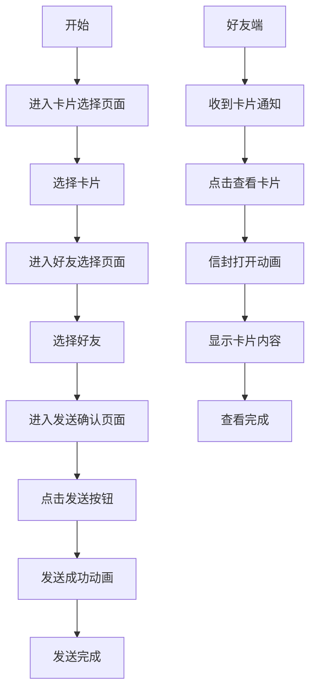

## 1. Product Overview
发卡给好友功能是一个社交互动功能，允许用户选择卡片并发送给好友，包含动画效果。
- 主要目的是增强用户间的互动体验，通过卡片形式传递祝福、消息等内容
- 目标用户为应用内的注册用户，提升用户活跃度和社交粘性

## 2. Core Features

### 2.1 User Roles
| Role | Registration Method | Core Permissions |
|------|---------------------|------------------|
| Registered User | App registration | 发送卡片、接收卡片、查看卡片历史 |

### 2.2 Feature Module
1. **卡片选择页面**: 卡片列表展示、卡片预览、选择卡片
2. **好友选择页面**: 好友列表展示、搜索好友、选择好友
3. **发送确认页面**: 卡片预览、好友信息确认、发送按钮
4. **发送成功页面**: 发送成功动画、返回按钮
5. **卡片接收页面**: 信封打开动画、卡片内容展示

### 2.3 Page Details
| Page Name | Module Name | Feature description |
|-----------|-------------|---------------------|
| 卡片选择页面 | 卡片列表 | 展示可选卡片，支持滑动浏览，点击卡片预览详情 |
| 卡片选择页面 | 卡片预览 | 点击卡片后放大预览，显示卡片完整内容 |
| 好友选择页面 | 好友列表 | 展示用户好友列表，支持滚动加载，点击选择好友 |
| 好友选择页面 | 搜索功能 | 支持搜索好友昵称，快速定位目标好友 |
| 发送确认页面 | 信息确认 | 显示所选卡片预览和好友信息，确认无误后发送 |
| 发送确认页面 | 发送操作 | 点击发送按钮，触发发送流程和动画效果 |
| 发送成功页面 | 成功动画 | 发送成功后显示动画效果，提示发送成功 |
| 卡片接收页面 | 信封动画 | 接收到卡片时显示信封打开动画效果 |
| 卡片接收页面 | 卡片展示 | 信封打开后显示卡片内容，支持查看详情 |

## 3. Core Process
用户发送卡片流程：选择卡片 → 选择好友 → 确认发送 → 发送成功（动画）
好友接收卡片流程：收到通知 → 打开卡片 → 信封动画 → 查看卡片内容

## 4. User Interface Design
### 4.1 Design Style
- 主色调：#4A90E2（蓝色）、#50E3C2（青色）
- 辅助色：#F5A623（橙色）、#D0021B（红色）
- 按钮风格：圆角按钮，有轻微的3D效果，点击时有反馈动画
- 字体：系统默认字体，标题16-20px，正文14px，提示文字12px
- 布局风格：卡片式布局，简洁现代，有层次感
- 图标风格：线性图标，简洁明了

### 4.2 Page Design Overview
| Page Name | Module Name | UI Elements |
|-----------|-------------|-------------|
| 卡片选择页面 | 卡片列表 | 网格布局，每张卡片有缩略图和名称，hover时有放大效果 |
| 卡片选择页面 | 卡片预览 | 居中放大显示，背景半透明，可点击关闭 |
| 好友选择页面 | 好友列表 | 列表布局，每项显示好友头像和昵称，点击有选中效果 |
| 好友选择页面 | 搜索功能 | 顶部搜索框，支持实时搜索，有搜索图标 |
| 发送确认页面 | 信息确认 | 卡片预览在上，好友信息在下，布局清晰 |
| 发送确认页面 | 发送按钮 | 底部固定按钮，颜色醒目，点击有加载状态 |
| 发送成功页面 | 成功动画 | 卡片飞出效果，伴有成功提示文字 |
| 卡片接收页面 | 信封动画 | 信封从中间打开，卡片逐渐显示，有纸张展开效果 |
| 卡片接收页面 | 卡片展示 | 卡片居中显示，内容清晰，可滑动查看 |

### 4.3 Responsiveness
- 移动端优先设计，适配不同屏幕尺寸
- 触摸优化，支持滑动操作和点击反馈
- 适配横屏和竖屏模式

### 4.4 3D Scene Guidance
- 卡片和信封有轻微的3D效果，增强视觉体验
- 动画过程中使用轻微的阴影和透视效果
- 确保动画流畅，不影响性能