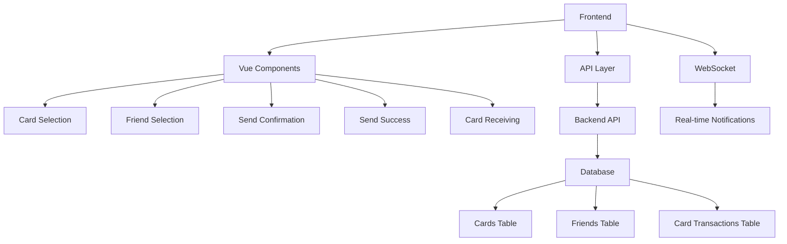
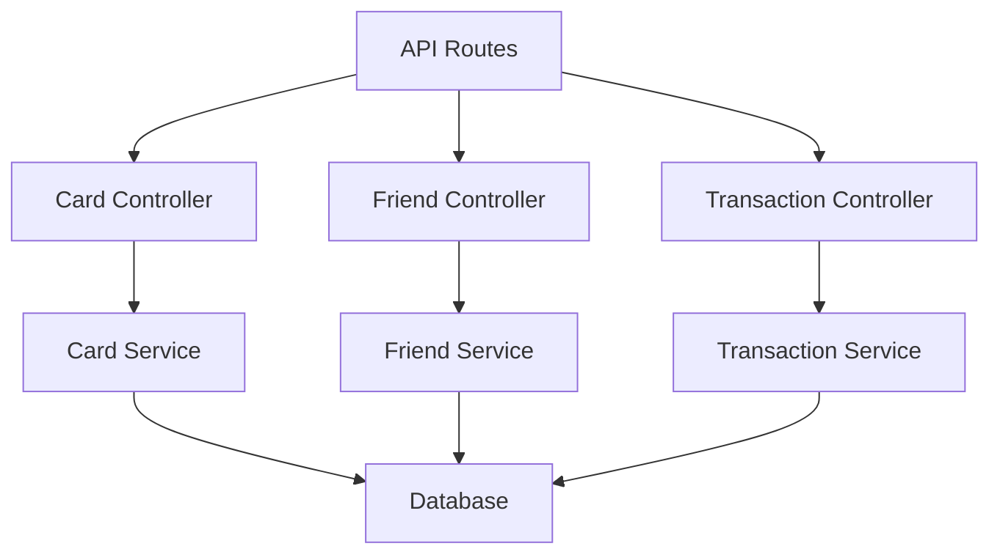
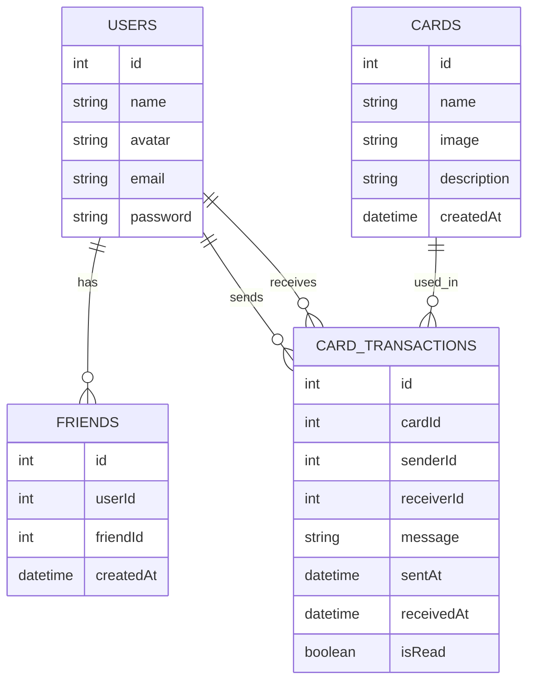

## 1. Architecture Design


## 2. Technology Description
- Frontend: Vue 3 + Vite + Tailwind CSS
- Backend: Express.js (existing)
- Database: MySQL (assumed, based on existing structure)
- WebSocket: For real-time notifications
- Animation: CSS animations + Vue transitions

## 3. Route Definitions
| Route | Purpose |
|-------|---------|
| /send-card | 卡片选择页面 |
| /send-card/friends | 好友选择页面 |
| /send-card/confirm | 发送确认页面 |
| /send-card/success | 发送成功页面 |
| /receive-card/:id | 卡片接收页面 |

## 4. API Definitions
### 4.1 GET /api/cards
- Purpose: Get available cards
- Response: Array of card objects
```typescript
interface Card {
  id: number;
  name: string;
  image: string;
  description: string;
}
```

### 4.2 GET /api/friends
- Purpose: Get user's friends
- Response: Array of friend objects
```typescript
interface Friend {
  id: number;
  userId: number;
  friendId: number;
  name: string;
  avatar: string;
}
```

### 4.3 POST /api/cards/send
- Purpose: Send card to friend
- Request Body:
```typescript
interface SendCardRequest {
  cardId: number;
  friendId: number;
  message?: string;
}
```
- Response:
```typescript
interface SendCardResponse {
  success: boolean;
  transactionId: number;
}
```

### 4.4 GET /api/cards/received/:id
- Purpose: Get received card details
- Response: Card details object
```typescript
interface ReceivedCard {
  id: number;
  cardId: number;
  cardName: string;
  cardImage: string;
  senderId: number;
  senderName: string;
  senderAvatar: string;
  message?: string;
  receivedAt: string;
}
```

## 5. Server Architecture Diagram


## 6. Data Model
### 6.1 Data Model Definition


### 6.2 Data Definition Language
```sql
-- Cards Table
CREATE TABLE IF NOT EXISTS cards (
    id INT AUTO_INCREMENT PRIMARY KEY,
    name VARCHAR(255) NOT NULL,
    image VARCHAR(255) NOT NULL,
    description TEXT,
    created_at TIMESTAMP DEFAULT CURRENT_TIMESTAMP
);

-- Friend Relationships Table
CREATE TABLE IF NOT EXISTS friends (
    id INT AUTO_INCREMENT PRIMARY KEY,
    user_id INT NOT NULL,
    friend_id INT NOT NULL,
    created_at TIMESTAMP DEFAULT CURRENT_TIMESTAMP,
    FOREIGN KEY (user_id) REFERENCES users(id),
    FOREIGN KEY (friend_id) REFERENCES users(id)
);

-- Card Transactions Table
CREATE TABLE IF NOT EXISTS card_transactions (
    id INT AUTO_INCREMENT PRIMARY KEY,
    card_id INT NOT NULL,
    sender_id INT NOT NULL,
    receiver_id INT NOT NULL,
    message TEXT,
    sent_at TIMESTAMP DEFAULT CURRENT_TIMESTAMP,
    received_at TIMESTAMP NULL,
    is_read BOOLEAN DEFAULT FALSE,
    FOREIGN KEY (card_id) REFERENCES cards(id),
    FOREIGN KEY (sender_id) REFERENCES users(id),
    FOREIGN KEY (receiver_id) REFERENCES users(id)
);

-- Insert sample cards
INSERT INTO cards (name, image, description) VALUES
('Birthday Card', 'img/qp_01.png', 'Happy Birthday!'),
('Thank You Card', 'img/qp_02.png', 'Thank you for everything!');
```